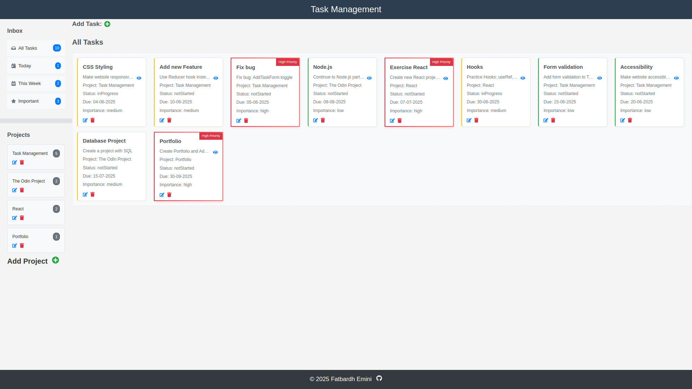
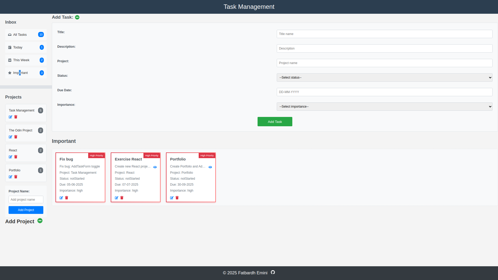

# Task Management Application

A modern, responsive web application built with React for managing tasks and projects. The application allows users to create, edit, delete, and filter tasks by various criteria, such as due date, importance, and associated projects. It features a clean, intuitive user interface with a sidebar for navigation and a grid-based task display.

---

## Preview (Link and Screenshots)

Live Demo: [Task Management Project](https://taskmanagement-project.netlify.app/)


 

---

## Table of Contents

- [Task Management Application](#task-management-application)
  - [Preview (Link and Screenshots)](#preview-link-and-screenshots)
  - [Table of Contents](#table-of-contents)
  - [Features](#features)
  - [Technologies Used](#technologies-used)
  - [Key React Features Utilized](#key-react-features-utilized)
    - [Hooks](#hooks)
  - [Project Structure](#project-structure)
  - [Installation](#installation)

---

## Features

- **Task Management:** Add, edit, and delete tasks with details including title, description, project, status, due date, and importance level (low, medium, high).  
- **Project Management:** Create, edit, and delete projects to organize tasks.  
- **Task Filtering:** Filter tasks by "All Tasks," "Today," "This Week," "Important," or specific projects.  
- **Responsive Design:** Fully responsive layout with a collapsible sidebar on mobile devices (below 768px).  
- **Interactive UI:** Task cards with importance-based styling, modals for full task descriptions, and hover effects for interactivity.  
- **Date Handling:** Robust date input validation and formatting (`dd-mm-yyyy`) using `date-fns`.  
- **Accessibility:** Includes ARIA labels for key interactive elements (e.g., GitHub link in footer).  
- **Persistent State:** State management via React Context API and reducer for consistent task and project data.

---

## Technologies Used

- **React:** JavaScript library for building the user interface.  
- **React Context API:** For global state management.  
- **date-fns:** For date parsing and formatting.  
- **React Icons:** For scalable icon components (e.g., `FaPlusCircle`, `FaEdit`).  
- **CSS:** Custom styles with responsive design and media queries.  
- **Vite:** Build tool for fast development and production bundling 

---

## Key React Features Utilized

- **Components:** Modular, reusable components (e.g., `TaskCard`, `AddTaskForm`, `ProjectsSection`) for a clean codebase.

### Hooks

- `useState`: Manages local component state (e.g., form inputs, modal visibility).  
- `useContext`: Accesses global state via `TaskContext` for tasks and projects.  
- `useEffect`: Handles side effects like resetting filters and closing modals on outside clicks.  
- `useReducer`: Manages complex state transitions with `taskReducer`.  
- `useRef`: References DOM elements to detect outside clicks in modals.

- **Context API:** Provides centralized state (`TaskContext`) for sharing data and dispatch functions.  
- **Event Handling:** Handles interactions like form submission, clicks, and toggles using event propagation (e.g., `stopPropagation`).  
- **Conditional Rendering:** Dynamically shows/hides modals, forms, and filtered views.  
- **Props:** Passes data and callbacks for component communication.

---

## Project Structure
```
├── src/
│   ├── images/
│   │   ├── Screenshot-1.png
│   │   ├── Screenshot-2.png
│   ├── components/
│   │   ├── Footer.jsx
│   │   ├── Header.jsx
│   │   ├── MainSection.jsx
│   │   ├── main-sections/
│   │   │   ├── AddTaskSection.jsx
│   │   │   ├── InboxSection.jsx
│   │   │   ├── ProjectsSection.jsx
│   │   │   ├── TasksDisplaySection.jsx
│   │   │   ├── AddProjectForm.jsx
│   │   │   ├── AddTaskForm.jsx
│   │   │   ├── TaskCard.jsx
│   ├── contexts/
│   │   ├── TaskContext.jsx
│   │   ├── TaskReducer.jsx
│   ├── utils/
│   │   ├── dateUtils.jsx
│   ├── App.jsx
│   ├── App.css
│   ├── index.css
│   ├── main.jsx
```
---

## Installation

1. **Clone the repository:**

   ```bash
   git clone https://github.com/fatbardheminii/task-management-app.git
   cd task-management-app

2. **Install dependencies:**

  ```bash
  npm install react-icons date-fns
  ```

3. **Run the development server:**

  ```bash
  npm run dev
  ```

  Open your browser and navigate to http://localhost:5173 (or the port Vite assigns) to see the app in action.
